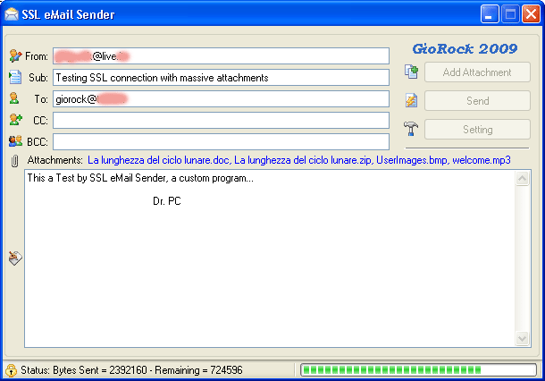



## SSL eMail Sender

### Description

A complex SSL eMail Sender with data encryption and more.

Since I never found nothing on the WEB about Visaual Basic sample, I've

tryed to reuse an old HTTPS code to get a protected SSL connection to

send eMail (old project do nothing but contains the core).

Program is also able to attachments, CC, BCC comma separated addresses

to send a complete 128-RC4-MD5 Hush encrypted packets data.

More works is still to do but at the moment it does work almost fine.

For all HOTMAIL Users the configuration Server & Port is done.

Please Readme.txt before enter in IDE.

Special thanks to Jason K. Resch & Anonimous for old project sample.

NEWS 2012:

Updated to communicate with SSL3.0 about Servers that supports fallback

at SSL2.0 protocol after initial handshake messages...
 
### More Info
 

             |
---                |---
**Submitted On**   |2012-05-09 11:53:10
**By**             |[GioRock](https://github.com/Planet-Source-Code/PSCIndex/blob/master/ByAuthor/giorock.md)
**Level**          |Advanced
**User Rating**    |5.0 (55 globes from 11 users)
**Compatibility**  |VB 6\.0
**Category**       |[Internet/ HTML](https://github.com/Planet-Source-Code/PSCIndex/blob/master/ByCategory/internet-html__1-34.md)
**World**          |[Visual Basic](https://github.com/Planet-Source-Code/PSCIndex/blob/master/ByWorld/visual-basic.md)
**Archive File**   |[SSL\_eMail\_222364592012\.zip](https://github.com/Planet-Source-Code/giorock-ssl-email-sender__1-71899/archive/master.zip)

